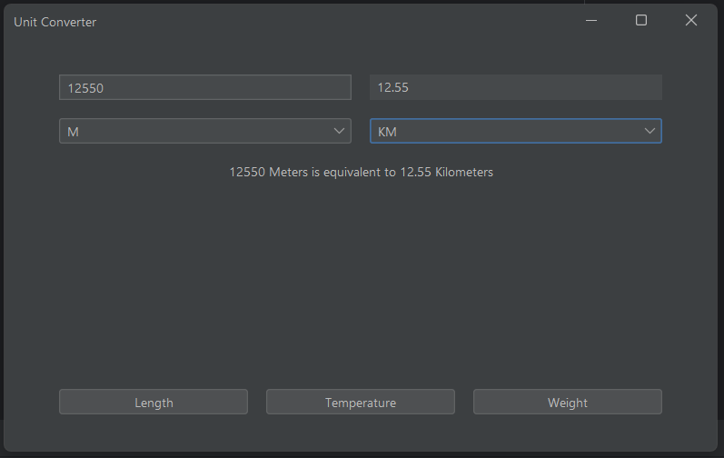

# Unit Converter

A desktop unit converter built with Java and Swing.
Supports Length, Weight, and Temperature conversions with a live result display.

## Features

- Convert between 14 length units (Kilometer → Nanometer, Imperial, Nautical Mile)
- Convert between 12 weight units (Ton → Microgram, Pound, Ounce, Stone)
- Convert between Celsius, Fahrenheit, and Kelvin
- Live conversion — result updates as you type
- Correct pluralization per unit (Foot → Feet, etc.)
- Clean number formatting — no unnecessary decimal places

## Preview



## Tech Stack

- Java 23
- Swing (GUI)
- Gradle (build)

## Project Structure
```
src/main/java/com/miguelindo/
├── Main.java
├── model/
│   └── ConversionResult.java
├── service/
│   └── ConversionService.java
├── unit/
│   ├── ConvertibleUnit.java
│   ├── LengthUnit.java
│   ├── WeightUnit.java
│   └── TemperatureUnit.java
└── ui/
    ├── MainWindow.java
    ├── ConverterPanel.java
    └── CategorySelector.java
```

## Download

Grab the latest JAR from [Releases](https://github.com/MigueleugiM26/Unit-Converter/releases)
and run it with `java -jar unit-converter.jar`

## Building & Running

Run directly with Gradle:
```bash
./gradlew run
```

Build a fat JAR (includes all dependencies):
```bash
./gradlew build
java -jar build/libs/unit-converter.jar
```

> On Windows, replace `./gradlew` with `gradlew.bat`

## Design Notes

Each unit category is a Java enum implementing the `ConvertibleUnit` interface.
Conversion logic lives on the enum itself — Length and Weight use a base-unit
factor (meters and kilograms respectively), while Temperature uses abstract
`toKelvin`/`fromKelvin` methods per constant to handle offset arithmetic.
